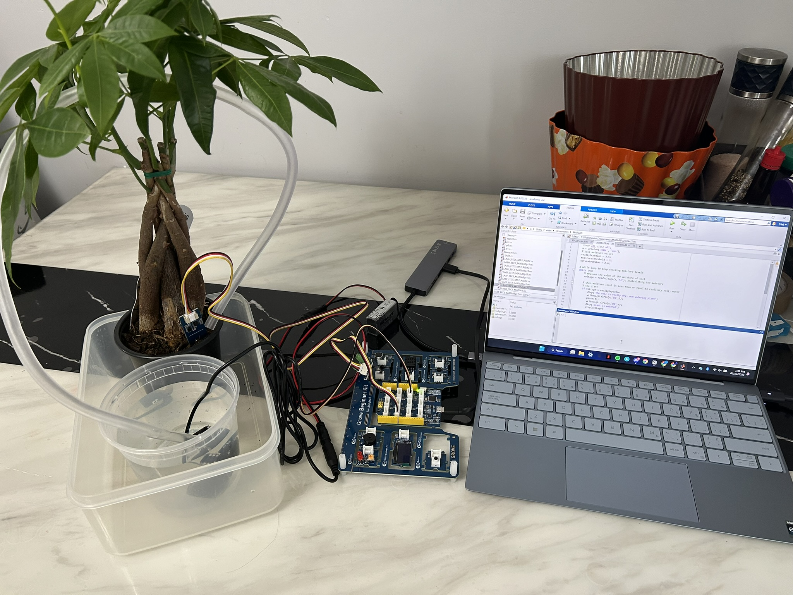
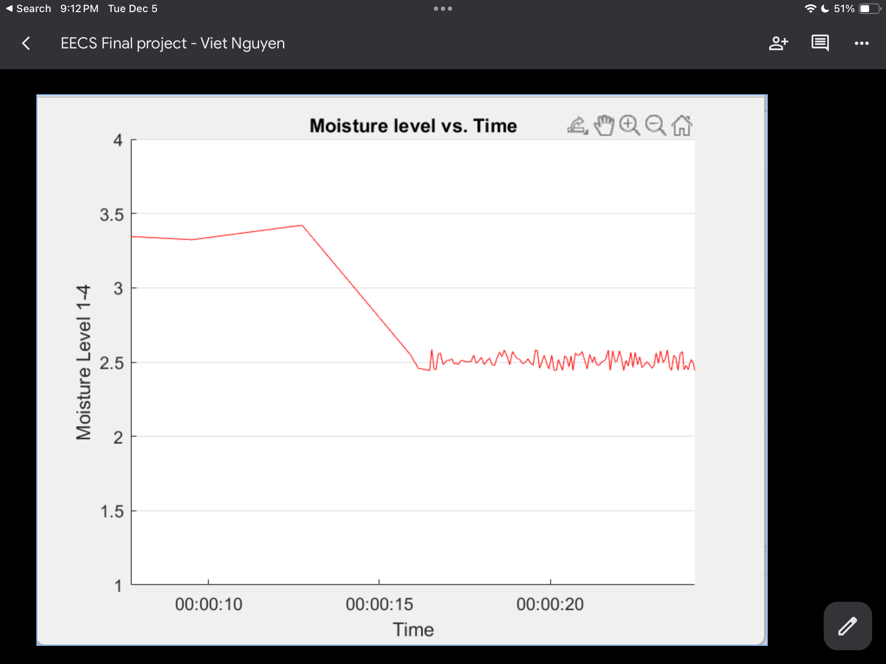
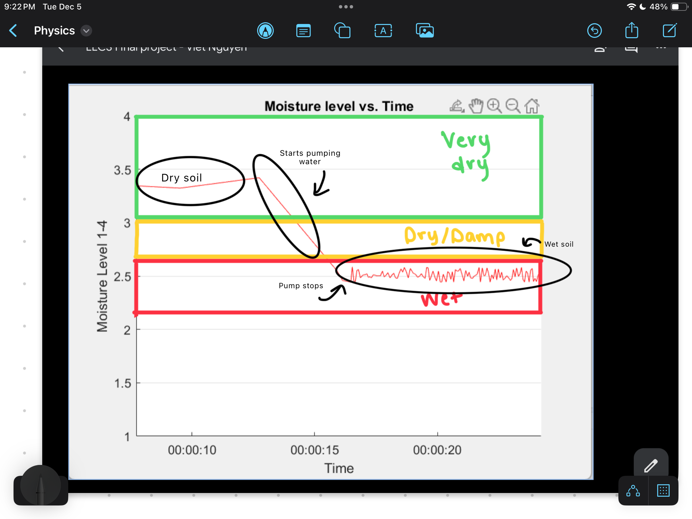

# Automated Plant Watering System (Arduino + MATLAB)

## Overview
This repository showcases an automated plant watering system that using an Arduino UNO to monitor soil moisture in real time and displays live data in MATLAB. The system automatically controls a water pump using a MOSFET-based switching circuit to safely handle higher current loads with the Arduino. 

This is the set up for the Automated plant watering system which includes the Arduino board and MOSFET connected to a 9V battery and moisture sensor. 

This is the graph for the moisture levels of the soil over time.

This image shows a labelled version of the graph with each section displaying soil moisture at certain voltages.
Very dry soil from 3-4 volts.
Dry/Damp soil from 2.6-3 volts.
Wet soil at 2.6 volts and below.
